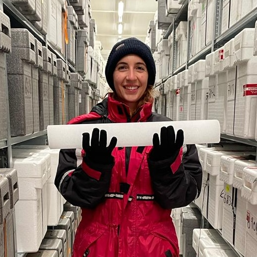
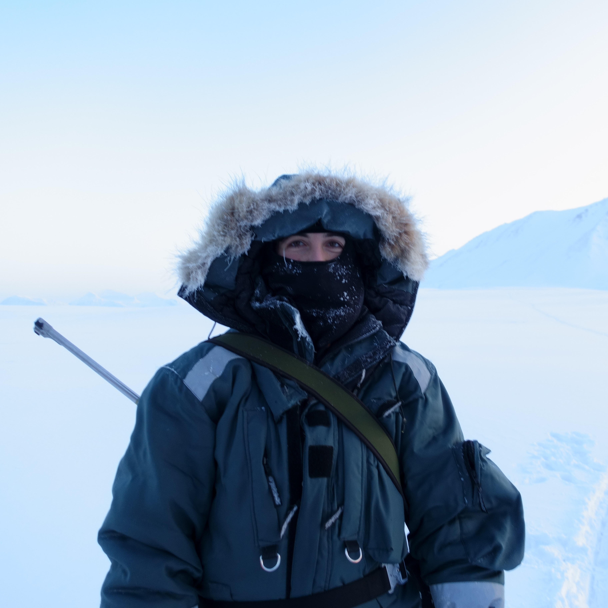

## Delia Segato
### Research fellow at CNR - Institute of Polar Sciences

I'm a research fellow at CNR - Institute of Polar Sciences in Venice (Italy) and my research focuses on the biogeochemical cycles of bromine, mercury and iodine using ice core reconstructions. I recently obtained my PhD in Science and Management of Climate Change at Ca' Foscari university of Venice in Italy. My expertise covers several areas of climate science, including paleoclimate, polar climate, atmospheric dynamics and chemistry, ocean and sea ice dynamics. 
I aim looking for new research opportunities on the field of paleoclimate modeling using ice core records spanning the Last Glacial Period.

### Current project

* Analysis of halogens and mercury in the SE-Dome ice core (Greenland) using ICP-MS and CV-AFS (cold vapour atomic fluorescence spectroscopy).

### Previous projects
* Reconstruction of mercury flux in the EGRIP ice core for the period 9000 - 15700 years before present. Find [here](https://www.nature.com/articles/s41561-023-01172-9) the article.
* Reconstruction of halogens (bromine and iodine) in the EGRIP ice core over the last 15700 years.
* The spatial variability of halogens and methanesulphonic acid deposition in the Southern Ocean reconstructed using five sub-Antarctic shallow cores. Find [here](https://www.sciencedirect.com/science/article/pii/S1352231023007057)) the article.
* Human and natural impact on the fire regime in the High North Atlantic Region reconstructed over the last 5 millennia from levoglucosan, black carbon and ammonium in the RECAP ice core. Find [here](https://doi.org/10.5194/cp-17-1533-2021) the article.

### Awards and honors
* **Best poster price** of the session *Biogeochemical cycles in the Earth' system* of the IPICS (International Partnerships in Ice Core Sciences) conference in Crans-Montana (Switzerland) in october 2022
* **Best student merit award** as best first-year student of the BSc in Environmental sciences at Ca' Foscari university of Venice
